| Name                 | NRP        | Kelas     |
| ---                  | ---        | ----------|
| Muhammad Hilman Azhar | 5025241264 |  |

> [!IMPORTANT]
> Remember to use the IP prefix allocation provided earlier for this pre-lab assignment (pra-praktikan) and for future ones.
> Access it on [Linktree](https://linktr.ee/jarkom) 

> [!TIP]
> **Due Date : 24th September 2026, 23.00 WIB**

> Prefix IP yang aku pakai: **`10.92`**. Semua node pakai appliance `netics-pc` (Alpine), GNS3 3.0.6.

## Put your GNS3 Project files here!

`Put file URL here`

## Bagian A.6

Topologi yang aku bikin di GNS3 lokal: netics-pc-3 jadi ethernet bridge di tengah, netics-pc-1 masuk lewat `eth0`, netics-pc-2 lewat `eth1`, dan netics-pc-4 lewat `eth2`.

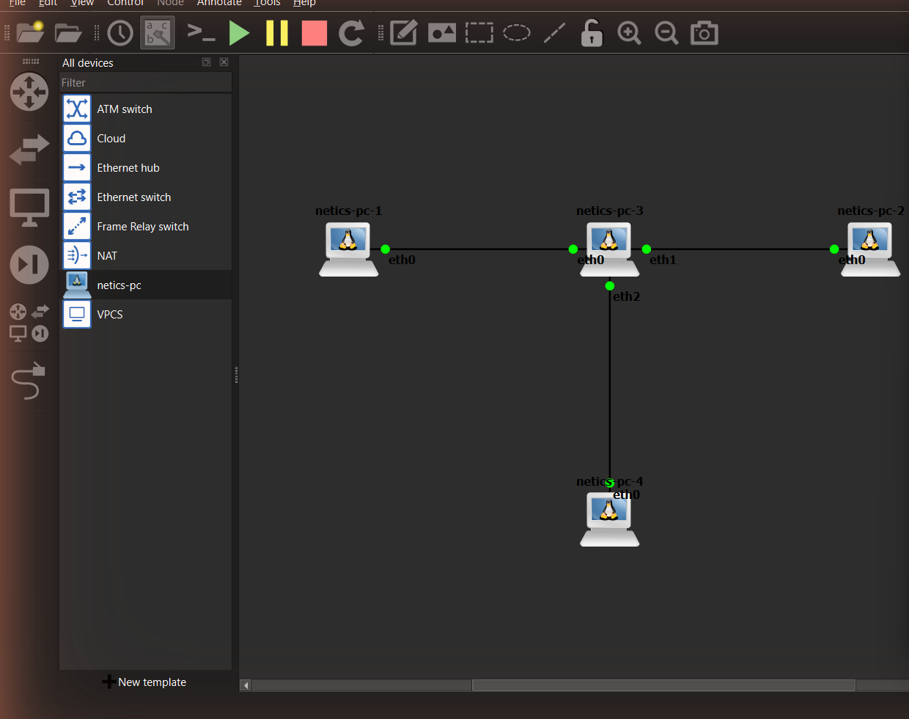

#### Soal 1

> Buatlah konfigurasi network seperti yang ada pada soal.
> Berikan jawaban konfigurasi network untuk masing-masing netics-pc-1, netics-pc-2 dan netics-pc-4.

> Set up the network configuration as specified in the problem. Provide the network configuration details for netics-pc-1, netics-pc-2, and netics-pc-4.

**Answer:**

Konfigurasi IP aku taruh lewat **Edit network configuration** (`/etc/network/interfaces`) biar nggak hilang pas node di-restart.

```
# netics-pc-1
auto eth0
iface eth0 inet static
	address 10.92.100.101
	netmask 255.255.255.0

# netics-pc-2
auto eth0
iface eth0 inet static
	address 10.92.100.102
	netmask 255.255.255.0

# netics-pc-4
auto eth0
iface eth0 inet static
	address 10.92.100.104
	netmask 255.255.255.0
```

netics-pc-3 nggak dikasih IP karena perannya cuma jadi bridge. Ketiga interface-nya (`eth0`, `eth1`, `eth2`) aku gabungin ke `br0`. Perintahnya aku simpan di `/root/init.sh` supaya bridge otomatis kebentuk lagi tiap node start:

```
# netics-pc-3 : /root/init.sh  (chmod +x /root/init.sh)
#!/bin/sh
brctl addbr br0
brctl addif br0 eth0
brctl addif br0 eth1
brctl addif br0 eth2
ip link set br0 up
```

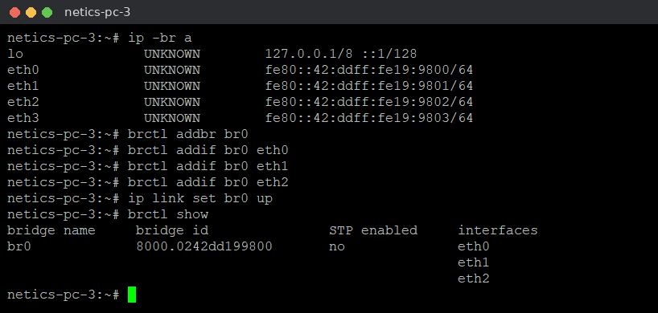

Dari `brctl show` kelihatan `br0` udah punya 3 interface (`eth0`, `eth1`, `eth2`), jadi frame dari satu sisi bisa diteruskan ke dua sisi lainnya.

#### Soal 2

> Buktikan koneksi antar netics-pc berhasil menggunakan ping dan mtr menunjukkan reply dari seluruh PC tanpa packet loss pada kondisi normal.

> Verify successful connectivity between the netics-pc's using `ping` and `mtr`, ensuring replies are received from all PCs without packet loss under normal conditions.

**Answer:**

```
# di netics-pc-1
ip -br a
ping -c 3 10.92.100.102
ping -c 3 10.92.100.104
mtr -r -c 10 10.92.100.102
mtr -r -c 10 10.92.100.104
```

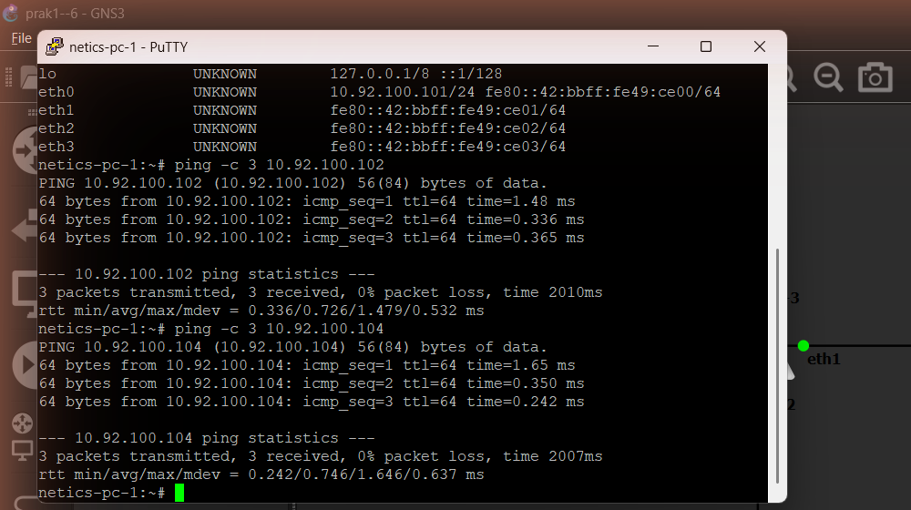

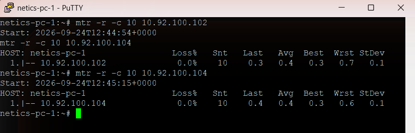

Ping dari netics-pc-1 ke netics-pc-2 dan netics-pc-4 dua-duanya reply dengan **0% packet loss**. Di `mtr` juga cuma ada 1 hop langsung ke tujuan (karena bridge kerja di layer 2, bukan router) dan `Loss%` **0.0%** untuk `.102` maupun `.104`.

#### Soal 3

> Implementasikan tc netem (packet loss) berhasil dan dibuktikan dengan mtr (loss meningkat mendekati 20%).

> The implementation of tc netem (packet loss) was successful and verified using mtr (loss increased to nearly 20%).

**Answer:**

```
# di netics-pc-3 (bridge)
tc qdisc replace dev eth0 root netem loss 20%
tc qdisc show dev eth0

# di netics-pc-1
mtr -r -c 100 -i 0.2 10.92.100.102
mtr -r -c 100 -i 0.2 10.92.100.104
```

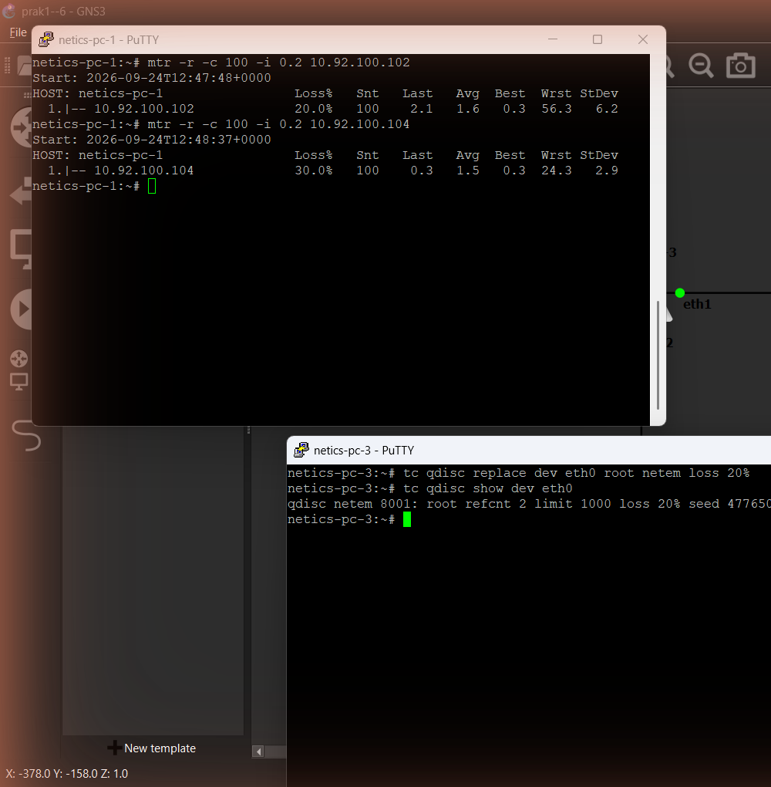

Aku pasang `netem loss 20%` di `eth0` netics-pc-3, yaitu interface yang ngarah ke netics-pc-1. Alasannya, semua balasan dari pc-2 maupun pc-4 ke pc-1 pasti keluar lewat interface ini, jadi dua jalur itu sama-sama kena loss ±20%. (Kalau dipasang di semua interface, loss-nya kena dua kali, pas request dan pas reply, jadi bisa ±36%.)

Hasil `mtr` dengan 100 paket:
- ke `10.92.100.102` → **Loss 20.0%**
- ke `10.92.100.104` → **Loss 30.0%**

Loss-nya nggak selalu pas 20% karena netem kerjanya probabilistik: tiap paket punya peluang 20% buat di-drop, jadi hasil per percobaan bisa naik turun di sekitar angka itu.

#### Soal 4

> Implementasikan tc tbf (throughput limit) berhasil dan dibuktikan dengan iperf3 (bitrate turun mendekati target 50 Mbps).

> The implementation of tc tbf (throughput limit) was successful, as verified by iperf3 (the bitrate dropped to near the 50 Mbps target).

**Answer:**

```
# di netics-pc-3 (bridge), qdisc netem diganti tbf 50 Mbps di semua interface
tc qdisc replace dev eth0 root tbf rate 50mbit burst 64k limit 64k
tc qdisc replace dev eth1 root tbf rate 50mbit burst 64k limit 64k
tc qdisc replace dev eth2 root tbf rate 50mbit burst 64k limit 64k
tc qdisc show

# di netics-pc-2 (server)
iperf3 -s

# di netics-pc-1 (client, UDP 100 Mbps selama 10 detik)
iperf3 -c 10.92.100.102 -u -b 100M -t 10

# reset limit
tc qdisc del dev eth0 root
tc qdisc del dev eth1 root
tc qdisc del dev eth2 root
```

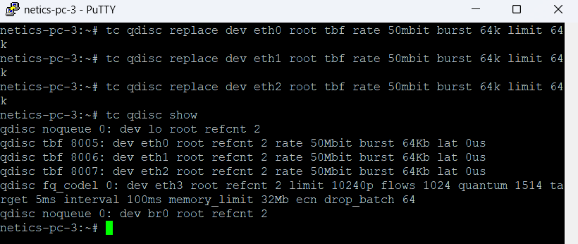

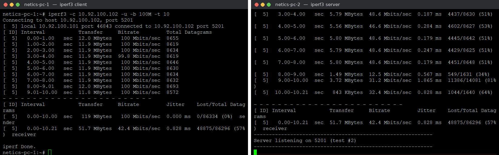

netics-pc-1 sengaja ngirim di **100 Mbits/sec** (dua kali dari limit) biar kelihatan efeknya. Di sisi server (netics-pc-2) bitrate yang diterima per detik turun ke sekitar **46.6 Mbits/sec**, dan rata-rata di sisi receiver **42.4 Mbits/sec**, dengan ±57% datagram hilang. Paket yang ngelebihin kapasitas 50 Mbps di-drop sama tbf di bridge. Rata-ratanya sedikit di bawah 50 karena di detik-detik terakhir sempat drop lebih jauh. Wajar, karena di node virtual throughput juga dipengaruhi CPU dan overhead UDP/IP.

## Bagian B.6

Topologi awal: 5 netics-pc (pc-1 s.d. pc-5) + 1 netics-pc capture point (pc-6), semuanya nyambung ke `Switch1`.

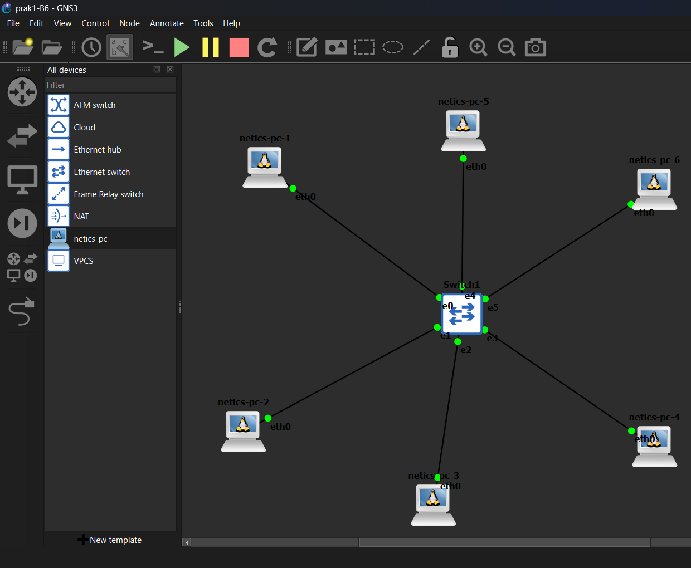

#### Soal 1

> Buatlah konfigurasi seperti pada perintah soal, yaitu 5 netics-pc dan 1 PC capture point terhubung melalui switch.
> Berikan juga jawaban konfigurasi network untuk masing-masing netics-pc.

> Configure the setup as specified in the instructions: 5 netics-pcs and 1 capture point PC connected via a switch.
> Also, provide the network configuration details for each netics-pc.

**Answer:**

| Node | Port switch | IP |
| --- | --- | --- |
| netics-pc-1 | Ethernet0 | 10.92.100.101/24 |
| netics-pc-2 | Ethernet1 | 10.92.100.102/24 |
| netics-pc-3 | Ethernet2 | 10.92.100.103/24 |
| netics-pc-4 | Ethernet3 | 10.92.100.104/24 |
| netics-pc-5 | Ethernet4 | 10.92.100.105/24 |
| netics-pc-6 (capture) | Ethernet5 | tanpa IP, cuma buat capture |

```
# netics-pc-1
auto eth0
iface eth0 inet static
	address 10.92.100.101
	netmask 255.255.255.0

# netics-pc-2
auto eth0
iface eth0 inet static
	address 10.92.100.102
	netmask 255.255.255.0

# netics-pc-3
auto eth0
iface eth0 inet static
	address 10.92.100.103
	netmask 255.255.255.0

# netics-pc-4
auto eth0
iface eth0 inet static
	address 10.92.100.104
	netmask 255.255.255.0

# netics-pc-5
auto eth0
iface eth0 inet static
	address 10.92.100.105
	netmask 255.255.255.0
```

Kelimanya ada di satu subnet yang sama (`10.92.100.0/24`), jadi bisa langsung ngobrol tanpa router. netics-pc-6 nggak aku kasih IP karena tugasnya cuma nangkep traffic.

#### Soal 2

> Buktikan koneksi antar netics-pc berhasil menggunakan ping dan mtr menunjukkan reply dari seluruh PC tanpa packet loss pada kondisi normal.

> Verify the connectivity between the netics-pc's using `ping` and `mtr`, ensuring replies are received from all PCs without packet loss under normal conditions.

**Answer:**

```
# di netics-pc-1
for i in 2 3 4 5; do ping -c 2 10.92.100.10$i; done
for i in 2 3 4 5; do mtr -r -c 5 10.92.100.10$i; done
```

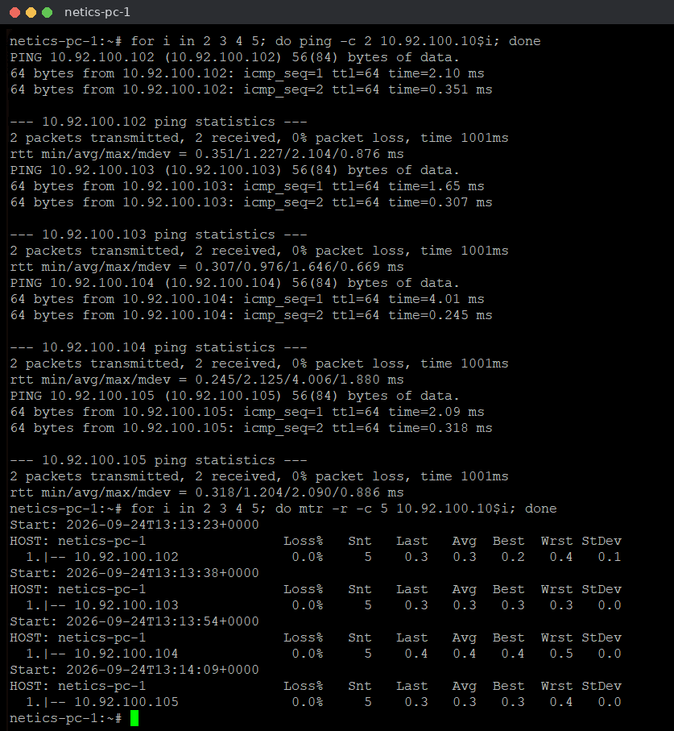

Semua PC (`.102` sampai `.105`) reply dengan **0% packet loss**, dan `mtr` ke masing-masing PC nunjukin **Loss% 0.0%** dengan 1 hop, karena semuanya satu segmen di switch yang sama.

#### Soal 3

> Jalankan termshark di netics-pc-6, lalu buat traffic ping antara netics-pc-1 dan netics-pc-2. Catat apakah traffic tersebut ikut tercapture di netics-pc-6

> Run termshark on netics-pc-6, then generate ping traffic between netics-pc-1 and netics-pc-2. Note whether that traffic is also captured on netics-pc-6.

**Answer:**

```
# di netics-pc-1 (ping terus-terusan)
ping 10.92.100.102

# di netics-pc-6
termshark -i eth0
```

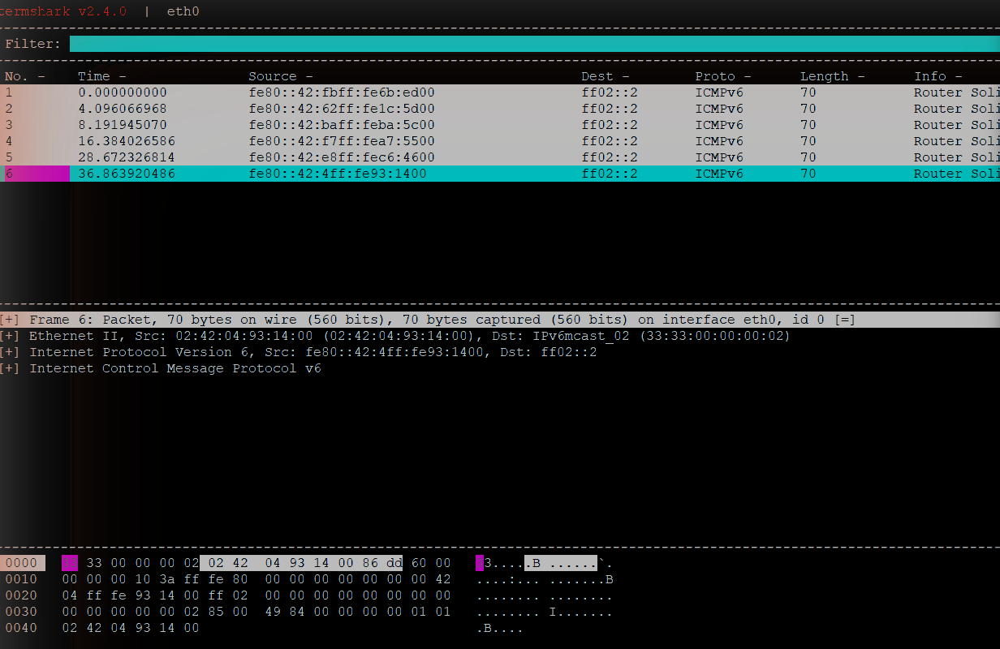

**Tidak tercapture.** Walaupun netics-pc-1 lagi ping ke netics-pc-2 terus-terusan, termshark di netics-pc-6 awalnya malah nggak mulai sama sekali ("The termshark UI will start when packets are detected on eth0..."). Pas akhirnya mulai, yang ketangkep cuma paket **ICMPv6 Router Solicitation** ke `ff02::2` (multicast), yang memang dikirim ke semua port. Nggak ada satu pun paket ICMP Echo antara `10.92.100.101` dan `10.92.100.102`. Ini karena switch udah hafal MAC address pc-1 dan pc-2 di MAC table-nya, jadi frame unicast cuma diterusin ke port tujuan (Ethernet0 ↔ Ethernet1), nggak ke port pc-6.

#### Soal 4

> Ganti node switch dengan hub, ulangi capture dari netics-pc-6 dengan skenario ping yang sama. Catat apakah traffic tersebut ikut tercapture di netics-pc-6

> Replace the switch node with a hub, and repeat the capture from netics-pc-6 using the same ping scenario. Note whether that traffic is also captured on netics-pc-6.

**Answer:**

`Switch1` aku hapus terus diganti `Hub1` dengan pemetaan port yang sama (pc-1 → Ethernet0 dst). Konfigurasi IP semua PC nggak diubah.

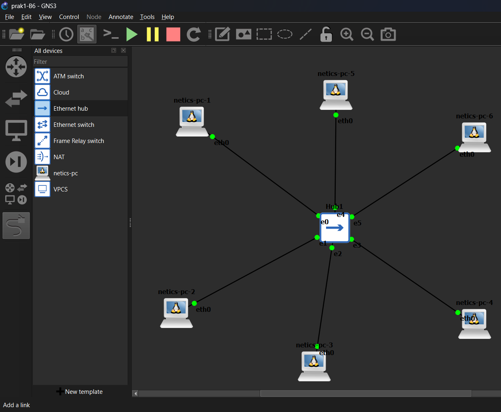

```
# di netics-pc-1
ping 10.92.100.102

# di netics-pc-6
termshark -i eth0
```

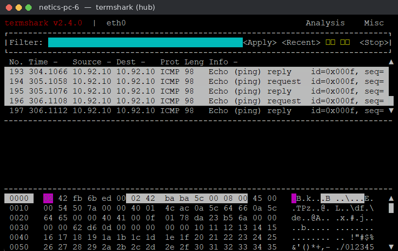

**Tercapture.** Begitu pakai hub, termshark di netics-pc-6 langsung penuh sama paket `ICMP Echo (ping) request` dari `10.92.100.101` dan `Echo (ping) reply` dari `10.92.100.102`, padahal pc-6 bukan pengirim maupun penerima. Hub nggak ngerti MAC address, jadi semua sinyal yang masuk diulang ke semua port lain.

#### Soal 5

> Bandingkan kedua hasil capture (switch vs hub), dan tuliskan kesimpulan mengenai broadcast domain dan collision domain berdasarkan hasil observasi sendiri

> Compare the two captures (switch vs. hub) and write a conclusion regarding broadcast domains and collision domains based on your own observations.

**Answer:**

| | Switch | Hub |
| --- | --- | --- |
| Ping unicast pc-1 ↔ pc-2 kelihatan di pc-6? | Tidak | Ya, request dan reply |
| Paket multicast/broadcast kelihatan di PC capture? (ICMPv6 RS di pc-6, ARP request di pc-7 [soal 6]) | Ya | Ya |

Kesimpulan dari yang aku lihat sendiri:
- **Collision domain:** di hub, frame unicast pc-1 ↔ pc-2 ikut nyampe ke pc-6, artinya semua port "berbagi kabel" yang sama. Satu hub = satu collision domain, dan makin banyak PC makin gampang tabrakan. Di switch, frame unicast cuma lewat port pengirim dan port tujuan, jadi tiap port punya collision domain sendiri.
- **Broadcast domain:** di dua skenario, paket yang tujuannya broadcast/multicast (ICMPv6 Router Solicitation, ARP request) tetap nyampe ke PC capture. Artinya **switch maupun hub sama-sama cuma punya 1 broadcast domain** (tanpa VLAN). Switch cuma misahin collision domain, bukan broadcast domain.
- Dampak praktisnya: di hub siapa aja yang nyolok bisa sniffing traffic orang lain, sedangkan di switch cuma broadcast yang bocor ke semua port.

#### Soal 6

> Tambahkan satu netics-pc ketujuh yang terhubung ke port terpisah pada switch/hub yang sama. Analisis apa kah traffic broadcast seperti ARP request tetap diterima oleh netisc-pc ketujuh tersebut pada kedua skenario (switch dan hub)
> Jelaskan secara singkat mengapa demikian

> Add a seventh netics-pc connected to a separate port on the same switch or hub. Analyze whether broadcast traffic, such as ARP requests, is still received by this seventh netics-pc in both scenarios (switch and hub).
> Briefly explain why this is the case.

**Answer:**

netics-pc-7 aku sambungin ke port `Ethernet6` (tanpa IP). ARP cache di pc-1 dikosongin dulu biar pc-1 terpaksa ngirim ARP request lagi sebelum ping.

```
# di netics-pc-7 (capture khusus ARP)
termshark -i eth0 -f arp

# di netics-pc-1
ip neigh flush all
ping -c 3 10.92.100.102
```

**Skenario hub:**

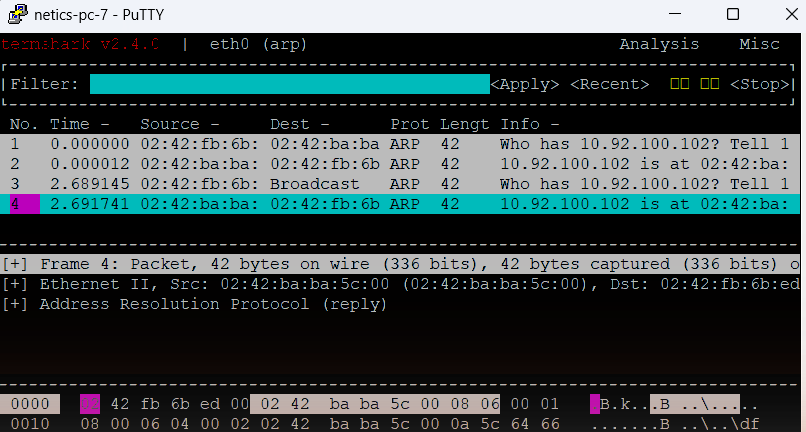

**Skenario switch:**

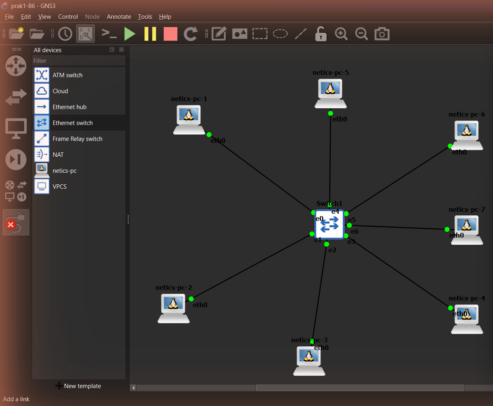

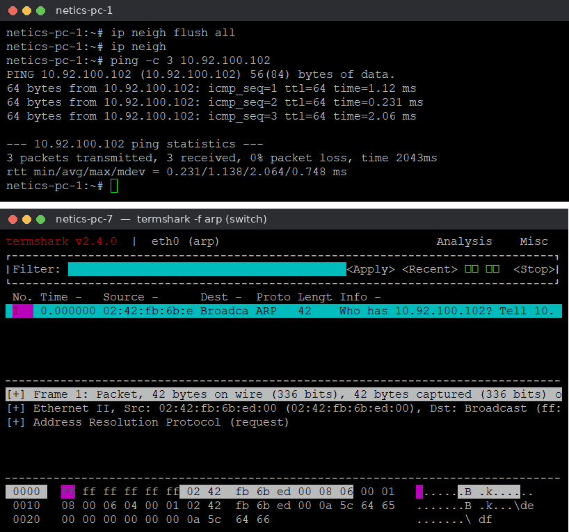

Hasilnya, **ARP request tetap diterima netics-pc-7 di kedua skenario:**
- **Hub:** pc-7 nangkep 4 frame ARP, yaitu request `Who has 10.92.100.102?` (termasuk yang tujuannya `Broadcast`) **dan juga reply-nya** `10.92.100.102 is at 02:42:...`, padahal reply itu unicast. Hub ngulang semuanya ke semua port.
- **Switch:** pc-7 cuma nangkep **1 frame**, yaitu `Who has 10.92.100.102? Tell 10.92.100.101` dengan Dst `Broadcast (ff:ff:ff:ff:ff:ff)`. ARP reply-nya (unicast dari pc-2 ke pc-1) nggak nyampe ke pc-7.

Kenapa gitu? ARP request dikirim ke alamat MAC broadcast `ff:ff:ff:ff:ff:ff` karena pc-1 belum tahu MAC pemilik IP `.102`. Switch memang dirancang buat nge-*flood* frame broadcast ke semua port (selain port asal), jadi pc-7 tetap kebagian. Bedanya, frame unicast (ARP reply, ICMP) cuma dikirim switch ke port tujuan, sedangkan hub nyebarin semuanya. Ini ngebuktiin lagi kalau switch dan hub sama-sama satu broadcast domain.
